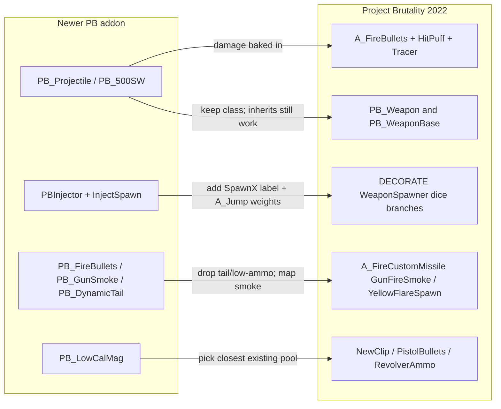

# PORTING_ADDONS.md — Porting Newer PB Weapon Add-ons into Project Brutality 2022

Companion to [AGENTS.md](AGENTS.md) and [README.md](README.md). Read AGENTS.md first for the big picture of this mod's layout, conventions, and entry-point lumps — this file focuses on the narrower problem of **pulling a weapon add-on written for a newer Project Brutality build into this 2022-era codebase**.

---

## 1. Purpose and audience

You have a newer Project Brutality weapon add-on (typically pinned to `version "4.11.x"` at the top of its `ZSCRIPT.zc`) and you want it to run inside Project Brutality 2022 (`version "4.5.0"`). The newer builds grew a bunch of helper classes, inventory tokens, action functions, and an event-handler-driven spawn injector that **do not exist in this tree**. This file tells you how to bridge the gap.

Audience: developers / agents integrating a third-party or upstream add-on. If you are authoring a brand-new weapon from scratch, the relevant recipe is **AGENTS.md section 5 → "Add a new weapon"** — come back here only when you are porting an existing add-on.

Important scoping constraint: **add-ons are folded into this mod folder, not loaded side-by-side.** Project Brutality 2022 used to ship the Glory Kills and Monster Pack add-ons as sibling folders; both have been merged in-tree (AGENTS.md section 1). Follow the same pattern for weapon add-ons — there is no "just drop a PK3 on top" path supported here.

---

## 2. Architectural gap — what newer PB has that 2022 doesn't

Newer Project Brutality ships a richer set of base classes, action functions, and a runtime spawn-injection system. PB 2022 has a much smaller surface. The picture below summarizes the mapping you will be performing:



### Absent in PB 2022 (grep confirms — these class / property / action names return zero hits):

- `PB_Projectile` base class, plus cartridge subclasses such as `PB_500SW`, and its properties: `.WHIZCRACK`, `.RipperCount`, `.PenetrationCount`, `.BaseDamage`.
- `PBInjector` base class and the `PB_EventHandler.InjectSpawn(...)` runtime registry.
- Tier-specific shot spawners referenced by injectors: `PB_ShotSpawnerT1`, `PB_ShotSpawnerT2`, `PB_ShotSpawnerT3`, `PB_ShotSpawnerT4`.
- Action helpers: `PB_FireBullets`, `PB_DynamicTail`, `PB_LowAmmoSoundWarning`, `PB_GunSmoke`.
- Shared low-caliber ammo pool `PB_LowCalMag`.

### Present in PB 2022 — use these instead:

- Weapon bases: `PB_Weapon` (DECORATE, [actors/Weapons/BaseWeapon.dec](actors/Weapons/BaseWeapon.dec)) on top of `PB_WeaponBase : DoomWeapon` (ZScript, [zscript/Weapons/BaseWeapon.zc](zscript/Weapons/BaseWeapon.zc)).
- Weapon-action plumbing: `A_DoPBWeaponAction`, `PB_WeaponRecoil`, `CheckUnloaded`, `PB_RespectIfNeeded`, the `UnloaderToken` / `respectItem` properties.
- Native fire helpers: `A_FireBullets` with the shared `"HitPuff"` and `"Tracer"` actors.
- Native FX spawners via `A_FireCustomMissile("GunFireSmoke" / "YellowFlareSpawn" / "ShakeYourAssMinor" / "RifleCaseSpawn" / "EmptyBrassPistol")`.
- Existing ammo pools: `NewClip`, `PistolBullets`, `RevolverAmmo`, plus the shotgun / rocket / plasma / BFG pools — pick one by damage / class fit, not by name similarity to `PB_LowCalMag`.

Authoritative reference files for the 2022 idiom:

- Base: [zscript/Weapons/BaseWeapon.zc](zscript/Weapons/BaseWeapon.zc), [actors/Weapons/BaseWeapon.dec](actors/Weapons/BaseWeapon.dec).
- Canonical hitscan revolver with `A_FireBullets` + tracer + unload flow: [actors/Weapons/Slot2/REVOLVER.dec](actors/Weapons/Slot2/REVOLVER.dec).
- Canonical rifle on `NewClip`: [actors/Weapons/Slot4/Carbine.dec](actors/Weapons/Slot4/Carbine.dec).

---

## 3. Porting checklist (high-level flow)

1. Inspect the add-on's folder structure and the `version` pin at the top of its `ZSCRIPT.zc` (usually `4.11.x`).
2. Grep the add-on's `.dec` / `.zc` / `.zsc` files for every `PB_*` class and action used, and cross-reference each one against this tree. Anything in the "Absent" list in section 2 is a port site.
3. Decide, per missing symbol, whether to **faithfully reimplement** it (rare — only when the weapon's identity depends on it) or **collapse it into the 2022 idiom** (default — what the Lever Action port does).
4. Pick file destinations inside the mod folder (section 6).
5. Translate DECORATE and SNDINFO first. Drop any add-on ZScript that depends on missing base classes (`PBInjector`, `PB_Projectile`, `PB_EventHandler` helpers) rather than trying to stub them.
6. Reserve a `DoomEdNum` in [zmapinfo.txt](zmapinfo.txt).
7. Wire spawning through an existing DECORATE spawner under [actors/SPAWNERS/WeaponSpawners/](actors/SPAWNERS/WeaponSpawners/). There is no runtime registry to call into — it's all dice branches.
8. Copy sprites into `SPRITES/WEAPONS/<Name>/` and sounds into `SOUNDS/COMBAT/WEAPONS/<Name>/`.
9. Launch GZDoom / UZDoom and fix any startup ZScript compile errors. Compile errors are fatal — nothing else matters until the mod boots.

---

## 4. API / class mapping cookbook

Concrete substitutions. Treat this as a lookup table — whenever you hit one of the left-hand patterns in the add-on, apply the right-hand rewrite.

- **Hitscan fire.** `PB_FireBullets("PB_357Magnum", 1, 0, 0, 0, 0)` → `A_FireBullets(0.1, 0.1, -1, <damage>, "HitPuff", FBF_NORANDOM, 8192, "Tracer", <xofs>, <yofs>)`. Follow the REVOLVER pattern in [actors/Weapons/Slot2/REVOLVER.dec](actors/Weapons/Slot2/REVOLVER.dec).
- **Damage lookup.** When the projectile class had `PB_Projectile.BaseDamage N`, bake `N` directly into the `damage` argument of `A_FireBullets`. Don't try to recreate the projectile class.
- **Muzzle smoke.** `PB_GunSmoke(0,0,0)` → `A_FireCustomMissile("GunFireSmoke", 0, 0, 0, 0, 0, 0)`.
- **Tail / low-ammo cues.** `PB_DynamicTail(...)` and `PB_LowAmmoSoundWarning(...)` → **drop**. There is no tail / low-ammo subsystem in 2022; the normal fire sound plus the existing weapon state feedback replaces them. Do not try to reimplement.
- **Runtime spawn injection.** `PBInjector` subclass + `handler.InjectSpawn('PB_ShotSpawnerT3', 'MyWeapon', ...)` → add a `SpawnMyWeapon` label plus weighted `A_Jump(N, "SpawnMyWeapon")` calls inside the matching `PB_SpawnerBase`-derived actor under [actors/SPAWNERS/WeaponSpawners/](actors/SPAWNERS/WeaponSpawners/). The 2022 spawner is a single hardcoded DECORATE actor, **not** a runtime registry — there is no equivalent to `InjectSpawn`.
- **Ammo pool.** `Weapon.AmmoType1 "PB_LowCalMag"` → pick the closest existing pool by damage profile, not by name:
  - Rifle caliber (carbine / lever action / DMR range) → `"NewClip"`.
  - Pistol / SMG → `"PistolBullets"`.
  - Revolver / heavy hand-cannon → `"RevolverAmmo"`.
- **Weapon base class.** `MyWeapon : PB_Weapon` → unchanged. `PB_Weapon` exists here ([actors/Weapons/BaseWeapon.dec](actors/Weapons/BaseWeapon.dec)) and itself inherits from `PB_WeaponBase : DoomWeapon`. The inheritance chain "just works".
- **Ripper / penetration projectiles.** Add-on `.zc` cartridge classes with `.RipperCount` / `.PenetrationCount` → usually droppable. If the weapon's identity really needs penetration, use `A_RailAttack(..., RGF_SILENT|RGF_NOPIERCING|RGF_EXPLICITANGLE, ...)` with a tracer puff — see the `pb_alttracer` branches in the Lever Action and Revolver for the pattern already used in-tree.

---

## 5. State / token conventions in PB 2022 that add-ons often trip over

- **Inherited states are already defined.** `PB_Weapon` provides `ReadyObject`, `DeselectObject`, `SelectFirstPersonLegs`, `SelectContinue`, plus the barrel-grab family: `ThrowBarrel`, `PlaceBarrel`, `IdleBarrel`, `FlashBarrelPunching`, `FlashBarrelKicking`, `FlashBarrelAirKicking`, `FlashBarrelSlideKicking`, `FlashBarrelSlideKickingStop`. If the add-on `Goto`s any of these, leave the references alone — **do not redefine them locally**, or you'll silently shadow the base-class behavior.
- **UnloaderToken naming must match everywhere.** The string on `PB_WeaponBase.UnloaderToken "<Name>"` must exactly match the `Actor <Name> : Inventory { … }` you define for the weapon **and** the argument passed to every `CheckUnloaded("<Name>")` in the weapon's state sequence. Name drift silently breaks the unload flow without raising a compile error. This was a bug in the original Lever Action add-on (it used `"PBLeverActionHasUnloaded"` on the property but `"LeverActionHasUnloaded"` on the actor + `CheckUnloaded`) and had to be normalized on port. Check all three sites when porting.
- **Inventory "boolean" tokens already exist.** The top of [DECORATE](DECORATE) defines a large block of 1-count `Inventory` actors used as flags: `Unloading`, `Zoomed`, `ADSmode`, `PB_LockScreenTilt`, `EquippedObject`, `GrabbedBarrel`, `GoFatality`, etc. Before adding any new inventory "flag" from the add-on, grep [DECORATE](DECORATE) — AGENTS.md section 4 calls this out specifically.
- **Cvars the add-on may read are mostly already present.** `pb_toggle_aim_hold`, `pb_alttracer`, `pb_nodeagle`, and the other `pb_*` cvars an add-on is likely to consume already live in [CVARINFO](CVARINFO). If the add-on only reads them, it will work as-is; only add new cvars if the add-on declares its own.

---

## 6. File layout when folding an add-on into the mod

Mirror the conventions from AGENTS.md section 5, with these add-on-specific notes:

- **Weapon DECORATE** → `actors/Weapons/Slot<N>/<Name>.dec`. **Use the real slot number** from the weapon's `Weapon.SlotNumber` property, not the folder name the add-on shipped under. The Lever Action add-on shipped under a folder called `Slot 3/` but is actually a Slot 4 weapon; the port puts it at [actors/Weapons/Slot4/LeverAction.dec](actors/Weapons/Slot4/LeverAction.dec).
- **DECORATE include** → add an `#include "actors/Weapons/Slot<N>/<Name>.dec"` line to [DECORATE](DECORATE) in the matching section, next to the other weapons in that slot.
- **Sprites** → `SPRITES/WEAPONS/<Name>/**`. Preserve whatever subfolder layout the add-on shipped — GZDoom does not care about paths under `SPRITES/`; it matches by the 4-character frame prefix in the filename (`LVR2`, `LVR4`, etc.), so frame names pass straight through.
- **Sounds** → `SOUNDS/COMBAT/WEAPONS/<Name>/*.ogg` (or whatever extension the add-on ships), with the paths matching the `sounds/...` strings you put in SNDINFO.
- **SNDINFO** → append to [SNDINFO.PBWeapons](SNDINFO.PBWeapons). GZDoom auto-loads every `SNDINFO*` lump (AGENTS.md section 2) — there is no master include list to update.
- **DoomEdNum** → append one line to the `DoomEdNums` block in [zmapinfo.txt](zmapinfo.txt), picking the next free number in the reserved **23000-range**. As of the Lever Action port the last assignment is `23133 = LeverAction`, so new ports should take `23134` and up. Do not reuse numbers. AGENTS.md section 4 calls out the range as 23000–23133 — extend it, don't overwrite.
- **Drop, don't stub, the following add-on files**:
  - The add-on's own `ZSCRIPT.zc` (its version pin will conflict and it pulls in missing classes).
  - Any modular spawn script that subclasses `PBInjector` — replaced by the DECORATE spawner edit.
  - Any `PB_Projectile`-derived cartridge / shot ZScript files — replaced by baking damage into `A_FireBullets`.

---

## 7. Spawner integration patterns

When the add-on's injector targets a specific tier spawner, map it to the matching file under [actors/SPAWNERS/WeaponSpawners/](actors/SPAWNERS/WeaponSpawners/):

- `PB_ShotSpawnerT1` … `PB_ShotSpawnerT4` → [actors/SPAWNERS/WeaponSpawners/ShotgunWeaponSpawners.dec](actors/SPAWNERS/WeaponSpawners/ShotgunWeaponSpawners.dec).
- Chaingun / Plasma / Rocket / SSG / Chainsaw / BFG → the sibling files in the same folder (`ChaingunWeaponSpawners.dec`, `PlasmaRifleWeaponSpawners.dec`, `RocketLauncherWeaponSpawners.dec`, `SuperShotgunWeaponSpawners.dec`, `ChainsawWeaponSpawner.dec`, `BFG9000WeaponSpawners.dec`). They are all listed from [actors/SPAWNERS/SpawnerScript.dec](actors/SPAWNERS/SpawnerScript.dec).

Each spawner has a `DiceRandom` top-level branch plus a `DiceMain` / `DiceProg` tree with one sub-label per monster tier (`EarlyLevelMob`, `LowLevelMob`, `MidLevelMob`, `HighLevelMob`, `DiceTier1`–`DiceTier4`, `DiceDeathWish`). To inject your weapon:

1. Add a `SpawnMyAddonWeapon` label at the bottom of the spawner, next to the existing `SpawnPB_Revolver` / `SpawnASG` / `SpawnLeverAction` labels. Use the same shape:

```
SpawnMyAddonWeapon:
    TNT1 A 1 A_RadiusGive("<NearToken>", 480, RGF_GIVESELF | RGF_CUBE | RGF_MONSTERS | RGF_ITEMS | RGF_NOSIGHT, 1)
    TNT1 A 0 A_SpawnItemEx("<MyAddonWeapon>", 0,0,0,0,0,0,0, SXF_TRANSFERSPECIAL | SXF_TRANSFERAMBUSHFLAG | SXF_TRANSFERPOINTERS | 288, 0, tid)
    Stop
```

  Pick `<NearToken>` from the existing `IsNear*` tokens in [DECORATE](DECORATE) (`IsNearShotgun`, `IsNearLowCalWeapon`, …). If none fit, omit the `A_RadiusGive` line — it's only used to suppress clustered duplicate spawns.

2. Inject `TNT1 A 0 A_Jump(<weight>, "SpawnMyAddonWeapon")` into **each** of the `DiceMain.*Mob` / `DiceProg.DiceTier*` / `DiceDeathWish` branches that should be able to produce the weapon, **before** that branch's `A_Jump(256, "SpawnNormal<Thing>")` fallback. The 256 line is the guaranteed fallback — anything after it is unreachable.

3. Add the label to the top-level `DiceRandom` list as well if the weapon should be reachable from the plain random branch.

This preserves the existing distribution and never replaces a vanilla fallback; it only adds a dice roll before it.

---

## 8. Editor numbers, cvars, menus, language strings (optional extensions)

- **DoomEdNum:** append one line in the `DoomEdNums` block of [zmapinfo.txt](zmapinfo.txt). Mandatory if the weapon should be placeable in maps or spawned via the spawner; skip it only for pure "inventory tokens" that never exist as world actors.
- **New cvar (rare — most add-ons reuse existing ones):** declare in [CVARINFO](CVARINFO) with the `pb_` / `cl_` / `fs_` prefix convention, expose it in [MENUDEF.txt](MENUDEF.txt) under the relevant submenu, add the `OPTMNU_*` strings to [language.enu](language.enu). This mirrors AGENTS.md section 5 → "Add a CVar".
- **PDA entries:** adding rows to [PDAWEAP](PDAWEAP) and [PDAWEAPT](PDAWEAPT) is optional. The weapon works without them; PDA integration is a polish pass, not a port requirement.

---

## 9. Case study: Lever Action end-to-end

The Lever Action integration exercises every rule above. Use it as a concrete reference; the before-snippets below are the shape you will see in the upstream add-on, the after-snippets are what actually ships in this tree.

### 9.1 Ammo pool

Before (add-on, `PB_LowCalMag`-based — 14 sites in the weapon file):

```
Weapon.AmmoType1 "PB_LowCalMag"
...
A_Giveinventory("PB_LowCalMag", 1)
A_Takeinventory("PB_LowCalMag", 1, TIF_NOTAKEINFINITE)
A_JumpIfInventory("PB_LowCalMag", 1, "Ready")
```

After (2022, `NewClip` — the rifle pool):

```
Weapon.AmmoType1 "NewClip"
...
A_Giveinventory("NewClip", 1)
A_Takeinventory("NewClip", 1, TIF_NOTAKEINFINITE)
A_JumpIfInventory("NewClip", 1, "Ready")
```

Rewrite every occurrence, not just the property declaration. Missing a site will cause an ammo-count desync that manifests as the weapon silently refusing to fire.

### 9.2 Fire call

Before:

```
PB_FireBullets("PB_444Marlin", 1, 0, 0, 0, 0)
```

After (baking the `.BaseDamage` from `PB_444Marlin` into the `A_FireBullets` damage arg — 90 for `.444`, 45 for the `.357` variant that the Lever Action's alt-fire uses):

```
A_FireBullets(0.1, 0.1, -1, 90, "HitPuff", FBF_NORANDOM, 8192, "Tracer", -2, 0)
A_StartSound("weapons/leveraction/magfire", CHAN_WEAPON)
```

### 9.3 Drop list

`PB_DynamicTail(...)` and `PB_LowAmmoSoundWarning(...)` — both removed outright. No replacement needed; the default fire sound plus the existing low-ammo visual cues cover the same UX.

### 9.4 Smoke / FX

Before:

```
PB_GunSmoke(0,0,0)
```

After:

```
A_FireCustomMissile("GunFireSmoke", 0, 0, 0, 0, 0, 0)
```

### 9.5 Token normalization

The original add-on had name drift between three sites:

Before (add-on — broken):

```
PB_WeaponBase.UnloaderToken "PBLeverActionHasUnloaded"
...
Actor LeverActionHasUnloaded : Inventory { ... }
...
CheckUnloaded("LeverActionHasUnloaded")
```

After (2022 — normalized to `"LeverActionHasUnloaded"` at all three sites, see [actors/Weapons/Slot4/LeverAction.dec](actors/Weapons/Slot4/LeverAction.dec)):

```
PB_WeaponBase.UnloaderToken "LeverActionHasUnloaded"
...
Actor LeverActionHasUnloaded : Inventory { ... }
...
CheckUnloaded("LeverActionHasUnloaded")
```

This silently-broken upstream bug is exactly the class of issue section 5 warns about. Always verify all three sites on port.

### 9.6 Spawner

Before (add-on — runtime injector class, not portable):

```
class LeverActionSpawnerInjector : PBInjector { ... handler.InjectSpawn(...) ... }
```

After (2022 — a `SpawnLeverAction` label plus `A_Jump(48, …)` (~18%) wired into every tier and the top-level `DiceRandom`, in [actors/SPAWNERS/WeaponSpawners/ShotgunWeaponSpawners.dec](actors/SPAWNERS/WeaponSpawners/ShotgunWeaponSpawners.dec)):

```
DiceRandom:
    TNT1 A 0 A_Jump(256, "SpawnNormalShotgun", "SpawnPB_Revolver", "SpawnASG", "SpawnPB_SGMagazine", "SpawnLeverAction")
...
EarlyLevelMob:
    TNT1 A 0 A_Jump(1,  "SpawnPB_SGMagazine")
    TNT1 A 0 A_Jump(4,  "SpawnASG")
    TNT1 A 0 A_Jump(12, "SpawnPB_Revolver")
    TNT1 A 0 A_Jump(48, "SpawnLeverAction")
    TNT1 A 0 A_Jump(256,"SpawnNormalShotgun")
...
SpawnLeverAction:
    TNT1 A 1 A_RadiusGive("IsNearLowCalWeapon", 480, RGF_GIVESELF | RGF_CUBE | RGF_MONSTERS | RGF_ITEMS | RGF_NOSIGHT, 1)
    TNT1 A 0 A_SpawnItemEx("LeverAction",0,0,0,0,0,0,0,SXF_TRANSFERSPECIAL | SXF_TRANSFERAMBUSHFLAG | SXF_TRANSFERPOINTERS | 288,0,tid)
    Stop
```

Same `A_Jump(48, "SpawnLeverAction")` edit repeated in every `DiceMain.*Mob`, `DiceProg.DiceTier*`, and `DiceDeathWish` branch, always **before** the `A_Jump(256, "SpawnNormalShotgun")` fallback.

### 9.7 File list delta

Touched or created on port:

- **New:** [actors/Weapons/Slot4/LeverAction.dec](actors/Weapons/Slot4/LeverAction.dec).
- **New assets:** `SPRITES/WEAPONS/LeverAction/**`, `SOUNDS/COMBAT/WEAPONS/LeverAction/**`.
- **Edited:** [DECORATE](DECORATE) (new `#include`), [zmapinfo.txt](zmapinfo.txt) (new `23133 = LeverAction`), [SNDINFO.PBWeapons](SNDINFO.PBWeapons) (fire / reload / cock sounds), [actors/SPAWNERS/WeaponSpawners/ShotgunWeaponSpawners.dec](actors/SPAWNERS/WeaponSpawners/ShotgunWeaponSpawners.dec) (spawner label + dice branches).
- **Dropped:** the add-on's own `ZSCRIPT.zc`, its `LeverActionSpawnerInjector` ZScript file, and any `PB_444Marlin` / `PB_357Magnum` cartridge classes.

---

## 10. Testing and troubleshooting

- **Launch:** `uzdoom.exe -iwad doom2.wad -file "Project Brutality 2022"` (same command shape as AGENTS.md section 6, also works with GZDoom). ZScript compile errors are fatal at startup — fix them before investigating anything else.
- **Quick test before touching spawners:** open the console and `summon <WeaponClass>`. This isolates "the weapon itself compiles and runs" from "the spawner wiring is right".
- **Missing-sound warnings** in the console (`S_FindSound: <name> not found`) → cross-check the string on the left of the SNDINFO line against every string passed to `A_PlaySoundEx` / `A_StartSound` in the weapon `.dec`. Casing matters on Linux builds of UZDoom; treat them as case-sensitive.
- **Missing-sprite warnings** → frame names are the first 4 characters of the PNG filename (`LVR2A0.png` → frame `LVR2 A`), regardless of which subfolder under `SPRITES/` they live in. Fix filenames, not paths.
- **"Unknown class `<X>`" at startup** → either the `.dec` is not `#include`d from [DECORATE](DECORATE), or the `DoomEdNum` conflicts with an existing entry in [zmapinfo.txt](zmapinfo.txt). Grep both.
- **Weapon never spawns from pickups** → the `A_Jump` weight is too small relative to the branch's fallthrough, or the injected `A_Jump(<weight>, "SpawnMyAddonWeapon")` line ended up **after** the branch's `A_Jump(256, "SpawnNormal<Thing>")` fallback (which is unconditional and stops the branch). Move the injection above the 256 line.
- **Unload sequence does nothing / silently skips** → you have name drift between `UnloaderToken`, the `Actor <Name> : Inventory` definition, and `CheckUnloaded("<Name>")`. This is the exact class of upstream bug described in section 5 and fixed for the Lever Action in section 9.5.
