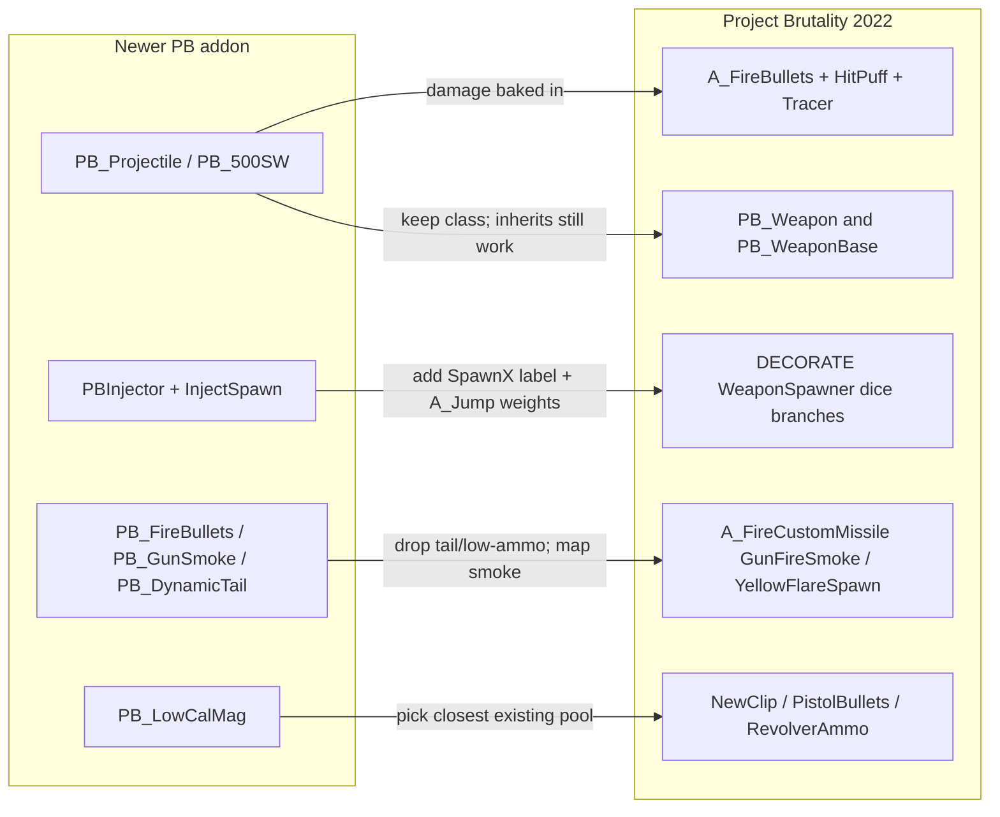

# PORTING_ADDONS.md — Porting Newer PB Weapon Add-ons into Project Brutality 2022

Companion to [AGENTS.md](AGENTS.md) and [README.md](README.md). Read AGENTS.md first for the big picture of this mod's layout, conventions, and entry-point lumps — this file focuses on the narrower problem of **pulling a weapon add-on written for a newer Project Brutality build into this 2022-era codebase**.

---

## 1. Purpose and audience

You have a newer Project Brutality weapon add-on (typically pinned to `version "4.11.x"` at the top of its `ZSCRIPT.zc`) and you want it to run inside Project Brutality 2022 (`version "4.5.0"`). The newer builds grew a bunch of helper classes, inventory tokens, action functions, and an event-handler-driven spawn injector that **do not exist in this tree**. This file tells you how to bridge the gap.

Audience: developers / agents integrating a third-party or upstream add-on. If you are authoring a brand-new weapon from scratch, the relevant recipe is **AGENTS.md section 5 → "Add a new weapon"** — come back here only when you are porting an existing add-on.

Important scoping constraint: **add-ons are folded into this mod folder, not loaded side-by-side.** Project Brutality 2022 used to ship the Glory Kills and Monster Pack add-ons as sibling folders; both have been merged in-tree (AGENTS.md section 1). Follow the same pattern for weapon add-ons — there is no "just drop a PK3 on top" path supported here.

---

## 2. Architectural gap — what newer PB has that 2022 doesn't

Newer Project Brutality ships a richer set of base classes, action functions, and a runtime spawn-injection system. PB 2022 has a much smaller surface. The picture below summarizes the mapping you will be performing:



### Absent in PB 2022 (grep confirms — these class / property / action names return zero hits):

- `PB_Projectile` base class, plus cartridge subclasses such as `PB_500SW`, and its properties: `.WHIZCRACK`, `.RipperCount`, `.PenetrationCount`, `.BaseDamage`.
- `PBInjector` base class and the `PB_EventHandler.InjectSpawn(...)` runtime registry.
- Tier-specific shot spawners referenced by injectors: `PB_ShotSpawnerT1`, `PB_ShotSpawnerT2`, `PB_ShotSpawnerT3`, `PB_ShotSpawnerT4`.
- Action helpers: `PB_FireBullets`, `PB_DynamicTail`, `PB_LowAmmoSoundWarning`, `PB_GunSmoke`.
- Shared low-caliber ammo pool `PB_LowCalMag`.

### Present in PB 2022 — use these instead:

- Weapon bases: `PB_Weapon` (DECORATE, [actors/Weapons/BaseWeapon.dec](actors/Weapons/BaseWeapon.dec)) on top of `PB_WeaponBase : DoomWeapon` (ZScript, [zscript/Weapons/BaseWeapon.zc](zscript/Weapons/BaseWeapon.zc)).
- Weapon-action plumbing: `A_DoPBWeaponAction`, `PB_WeaponRecoil`, `CheckUnloaded`, `PB_RespectIfNeeded`, the `UnloaderToken` / `respectItem` properties.
- Native fire helpers: `A_FireBullets` with the shared `"HitPuff"` and `"Tracer"` actors.
- Native FX spawners via `A_FireCustomMissile("GunFireSmoke" / "YellowFlareSpawn" / "ShakeYourAssMinor" / "RifleCaseSpawn" / "EmptyBrassPistol")`.
- Existing ammo pools: `NewClip`, `PistolBullets`, `RevolverAmmo`, plus the shotgun / rocket / plasma / BFG pools — pick one by damage / class fit, not by name similarity to `PB_LowCalMag`.
- **Monster-sourced weapon wear:** undroppable `Ammo` + `AttachToOwner` refill + `WeaponBreak` — see **`actors/Weapons/MonsterWeaponDurability.dec`**, **`PB_WeaponBase`** in **`zscript/Weapons/BaseWeapon.zc`**, and **AGENTS.md §5 → “Monster-sourced weapons — PBX-style wear”** (same design language as **PBX-Weapons** / Excavator-style durability).

Authoritative reference files for the 2022 idiom:

- Base: [zscript/Weapons/BaseWeapon.zc](zscript/Weapons/BaseWeapon.zc), [actors/Weapons/BaseWeapon.dec](actors/Weapons/BaseWeapon.dec).
- Canonical hitscan revolver with `A_FireBullets` + tracer + unload flow: [actors/Weapons/Slot2/REVOLVER.dec](actors/Weapons/Slot2/REVOLVER.dec).
- Canonical rifle on `NewClip`: [actors/Weapons/Slot4/Carbine.dec](actors/Weapons/Slot4/Carbine.dec).

---

## 3. Porting checklist (high-level flow)

1. Inspect the add-on's folder structure and the `version` pin at the top of its `ZSCRIPT.zc` (usually `4.11.x`).
2. Grep the add-on's `.dec` / `.zc` / `.zsc` files for every `PB_*` class and action used, and cross-reference each one against this tree. Anything in the "Absent" list in section 2 is a port site.
3. Decide, per missing symbol, whether to **faithfully reimplement** it (rare — only when the weapon's identity depends on it) or **collapse it into the 2022 idiom** (default — what the Lever Action port does).
4. Pick file destinations inside the mod folder (section 6).
5. Translate DECORATE and SNDINFO first. Drop any add-on ZScript that depends on missing base classes (`PBInjector`, `PB_Projectile`, `PB_EventHandler` helpers) rather than trying to stub them.
6. Prepend the mandatory `GoFatality` Fire-state freeze guard (`if(CountInv("GoFatality") >= 1) SetPlayerProperty(0,1,0); else SetPlayerProperty(0,0,0);`) to every fire entry point on the ported weapon — see section 5 for the full rationale and template.
7. Reserve a `DoomEdNum` in [zmapinfo.txt](zmapinfo.txt).
8. Wire spawning through an existing DECORATE spawner under [actors/SPAWNERS/WeaponSpawners/](actors/SPAWNERS/WeaponSpawners/). There is no runtime registry to call into — it's all dice branches.
9. Copy sprites into `SPRITES/WEAPONS/<Name>/` and sounds into `SOUNDS/COMBAT/WEAPONS/<Name>/`.
10. Launch GZDoom / UZDoom and fix any startup ZScript compile errors. Compile errors are fatal — nothing else matters until the mod boots.

---

## 4. API / class mapping cookbook

Concrete substitutions. Treat this as a lookup table — whenever you hit one of the left-hand patterns in the add-on, apply the right-hand rewrite.

- **Hitscan fire.** `PB_FireBullets("PB_357Magnum", 1, 0, 0, 0, 0)` → `A_FireBullets(0.1, 0.1, -1, <damage>, "HitPuff", FBF_NORANDOM, 8192, "Tracer", <xofs>, <yofs>)`. Follow the REVOLVER pattern in [actors/Weapons/Slot2/REVOLVER.dec](actors/Weapons/Slot2/REVOLVER.dec).
- **Damage lookup.** When the projectile class had `PB_Projectile.BaseDamage N`, bake `N` directly into the `damage` argument of `A_FireBullets`. Don't try to recreate the projectile class.
- **Muzzle smoke.** `PB_GunSmoke(0,0,0)` → `A_FireCustomMissile("GunFireSmoke", 0, 0, 0, 0, 0, 0)`.
- **Tail / low-ammo cues.** `PB_DynamicTail(...)` and `PB_LowAmmoSoundWarning(...)` → **drop**. There is no tail / low-ammo subsystem in 2022; the normal fire sound plus the existing weapon state feedback replaces them. Do not try to reimplement.
- **Runtime spawn injection.** `PBInjector` subclass + `handler.InjectSpawn('PB_ShotSpawnerT3', 'MyWeapon', ...)` → add a `SpawnMyWeapon` label plus weighted `A_Jump(N, "SpawnMyWeapon")` calls inside the matching `PB_SpawnerBase`-derived actor under [actors/SPAWNERS/WeaponSpawners/](actors/SPAWNERS/WeaponSpawners/). The 2022 spawner is a single hardcoded DECORATE actor, **not** a runtime registry — there is no equivalent to `InjectSpawn`.
- **Ammo pool.** `Weapon.AmmoType1 "PB_LowCalMag"` → pick the closest existing pool by damage profile, not by name:
  - Rifle caliber (carbine / lever action / DMR range) → `"NewClip"`.
  - Pistol / SMG → `"PistolBullets"`.
  - Revolver / heavy hand-cannon → `"RevolverAmmo"`.
- **Weapon base class.** `MyWeapon : PB_Weapon` → unchanged. `PB_Weapon` exists here ([actors/Weapons/BaseWeapon.dec](actors/Weapons/BaseWeapon.dec)) and itself inherits from `PB_WeaponBase : DoomWeapon`. The inheritance chain "just works".
- **Ripper / penetration projectiles.** Add-on `.zc` cartridge classes with `.RipperCount` / `.PenetrationCount` → usually droppable. If the weapon's identity really needs penetration, use `A_RailAttack(..., RGF_SILENT|RGF_NOPIERCING|RGF_EXPLICITANGLE, ...)` with a tracer puff — see the `pb_alttracer` branches in the Lever Action and Revolver for the pattern already used in-tree.

---

## 5. State / token conventions in PB 2022 that add-ons often trip over

- **Inherited states are already defined.** `PB_Weapon` provides `ReadyObject`, `DeselectObject`, `SelectFirstPersonLegs`, `SelectContinue`, plus the barrel-grab family: `ThrowBarrel`, `PlaceBarrel`, `IdleBarrel`, `FlashBarrelPunching`, `FlashBarrelKicking`, `FlashBarrelAirKicking`, `FlashBarrelSlideKicking`, `FlashBarrelSlideKickingStop`. If the add-on `Goto`s any of these, leave the references alone — **do not redefine them locally**, or you'll silently shadow the base-class behavior.
- **UnloaderToken naming must match everywhere.** The string on `PB_WeaponBase.UnloaderToken "<Name>"` must exactly match the `Actor <Name> : Inventory { … }` you define for the weapon **and** the argument passed to every `CheckUnloaded("<Name>")` in the weapon's state sequence. Name drift silently breaks the unload flow without raising a compile error. This was a bug in the original Lever Action add-on (it used `"PBLeverActionHasUnloaded"` on the property but `"LeverActionHasUnloaded"` on the actor + `CheckUnloaded`) and had to be normalized on port. Check all three sites when porting.
- **Inventory "boolean" tokens already exist.** The top of [DECORATE](DECORATE) defines a large block of 1-count `Inventory` actors used as flags: `Unloading`, `Zoomed`, `ADSmode`, `PB_LockScreenTilt`, `EquippedObject`, `GrabbedBarrel`, `GoFatality`, etc. Before adding any new inventory "flag" from the add-on, grep [DECORATE](DECORATE) — AGENTS.md section 4 calls this out specifically.
- **`GoFatality` Fire-state freeze guard is mandatory.** Every ported weapon **must** prepend the following guard to the top of its primary `Fire:` label (and any other fire entry points — `AltFire`, `Fire2`, `Hold`, `AltHold`, burst / akimbo / zoomed variants):

    ```
    TNT1 A 0 {
        if(CountInv("GoFatality") >= 1) {
            SetPlayerProperty(0,1,0);
        }
        else {
            SetPlayerProperty(0,0,0);
        }
    }
    ```

    Where the Fire state already opens with a `TNT1 A 0 { A_WeaponOffset(0,32); … }` initializer block, merge the `if/else` into that block before `A_WeaponOffset`. Where it doesn't, add the guard as a new state line at the very top of `Fire:`, above any `JumpIfInventory` redirects. **Why:** the central `A_DoPBWeaponAction` check in [zscript/Weapons/BaseWeapon.zc](zscript/Weapons/BaseWeapon.zc) that routes to `Steady` on `GoFatality` only runs from `Ready`-style tics; inside `Fire:`, none of that plumbing runs, so on the first tic of firing a freshly-set `GoFatality` (from a monster's `A_GiveToTarget("GoFatality", 1)`) slips past and the player keeps moving while the `Fatality*` cutscene in [actors/Player/PLAYER.dec](actors/Player/PLAYER.dec) is spinning up. The guard sets `PROP_FROZEN` (`SetPlayerProperty` property index `0`) directly from the weapon side to close that window, and defensively clears it on the non-fatality branch in case a previous fatality exited abnormally. Canonical template: [actors/Weapons/Slot3/AUTOSHOTGUN.dec](actors/Weapons/Slot3/AUTOSHOTGUN.dec) `Fire:` (line ~595). Idiom reference: the `Fatality*` labels in [actors/Player/PLAYER.dec](actors/Player/PLAYER.dec) bookend themselves with the exact same `SetPlayerProperty(0,1,0)` / `SetPlayerProperty(0,0,0)` pair. Already applied to every addon-ported weapon in-tree: [Slot2/RiotShield.dec](actors/Weapons/Slot2/RiotShield.dec), [Slot3/MarauderSSG.dec](actors/Weapons/Slot3/MarauderSSG.dec), [Slot4/Carbine.dec](actors/Weapons/Slot4/Carbine.dec), [Slot4/LeverAction.dec](actors/Weapons/Slot4/LeverAction.dec), [Slot4/MetalSniper.dec](actors/Weapons/Slot4/MetalSniper.dec), [Slot5/Paingiver.dec](actors/Weapons/Slot5/Paingiver.dec) — mirror their placement on any new port.
- **Cvars the add-on may read are mostly already present.** `pb_toggle_aim_hold`, `pb_alttracer`, `pb_nodeagle`, and the other `pb_*` cvars an add-on is likely to consume already live in [CVARINFO](CVARINFO). If the add-on only reads them, it will work as-is; only add new cvars if the add-on declares its own.

---

## 6. File layout when folding an add-on into the mod

Mirror the conventions from AGENTS.md section 5, with these add-on-specific notes:

- **Weapon DECORATE** → `actors/Weapons/Slot<N>/<Name>.dec`. **Use the real slot number** from the weapon's `Weapon.SlotNumber` property, not the folder name the add-on shipped under. The Lever Action add-on shipped under a folder called `Slot 3/` but is actually a Slot 4 weapon; the port puts it at [actors/Weapons/Slot4/LeverAction.dec](actors/Weapons/Slot4/LeverAction.dec).
- **DECORATE include** → add an `#include "actors/Weapons/Slot<N>/<Name>.dec"` line to [DECORATE](DECORATE) in the matching section, next to the other weapons in that slot.
- **Sprites** → `SPRITES/WEAPONS/<Name>/**`. Preserve whatever subfolder layout the add-on shipped — GZDoom does not care about paths under `SPRITES/`; it matches by the 4-character frame prefix in the filename (`LVR2`, `LVR4`, etc.), so frame names pass straight through.
- **Sounds** → `SOUNDS/COMBAT/WEAPONS/<Name>/*.ogg` (or whatever extension the add-on ships), with the paths matching the `sounds/...` strings you put in SNDINFO.
- **SNDINFO** → append to [SNDINFO.txt](SNDINFO.txt) in the `// SNDINFO.PBWeapons` (or a new) section. A single merged file keeps everything discoverable; match the `sounds/...` paths your weapon uses.
- **SBARINFO** → append a per-weapon `IsSelected <WeaponClass> { ... }` block to [SBARINFO.txt](SBARINFO.txt). **This is mandatory for any weapon that should show up on the fullscreen HUD** — without it, the HUD silently falls through to the "no ammo panel" default and the player sees no magazine / reserve readout while the weapon is ready. Use the actual DECORATE class name (no automatic `PB_` prefix — e.g. `Paingiver`, `OldHMG` are unprefixed; `PB_MetalSniper` is prefixed). Pick the layout by ammo family, not by slot:
    - **Rifle / `NewClip`** → mirror `PB_LMG` (yellow: `BARBACY1/2`, `BAMBAR1`, `CURBAR1`, `AMMOIC1`, `RESBAR1`).
    - **Pistol / SMG** → mirror `PB_SMG` (tan: `BARBACT1/2`, `BAMBAR2`, `CURBAR2`, `AMMOIC2`, `RESBAR2`).
    - **Shotgun** → mirror `PB_Shotgun` / `PB_SSG`.
    - **Rocket / explosive** → mirror `PB_RocketLauncher` / `Paingiver` (red: `BARBACR1/2`, `BAMBAR4`, `CURBAR4`, `AMMOIC4`, `RESBAR4`).
    - **Plasma / BFG** → mirror `PB_M1Plasma` / `PB_BFG9000`.

    If the weapon has no magazine (single-pool weapons like `PB_Minigun` / `PB_MG42`), omit the `ammo2` lines and draw only `ammo1`. Insert the new block next to the existing weapons in the same ammo family so the file stays grouped.
- **DoomEdNum** → append one line to the `DoomEdNums` block in [zmapinfo.txt](zmapinfo.txt), picking the next free number in the reserved **23000-range**. As of the Lever Action port the last assignment is `23133 = LeverAction`, so new ports should take `23134` and up. Do not reuse numbers. AGENTS.md section 4 calls out the range as 23000–23133 — extend it, don't overwrite.
- **Drop, don't stub, the following add-on files**:
  - The add-on's own `ZSCRIPT.zc` (its version pin will conflict and it pulls in missing classes).
  - Any modular spawn script that subclasses `PBInjector` — replaced by the DECORATE spawner edit.
  - Any `PB_Projectile`-derived cartridge / shot ZScript files — replaced by baking damage into `A_FireBullets`.

---

## 7. Spawner integration patterns

When the add-on's injector targets a specific tier spawner, map it to the matching file under [actors/SPAWNERS/WeaponSpawners/](actors/SPAWNERS/WeaponSpawners/):

- `PB_ShotSpawnerT1` … `PB_ShotSpawnerT4` → [actors/SPAWNERS/WeaponSpawners/ShotgunWeaponSpawners.dec](actors/SPAWNERS/WeaponSpawners/ShotgunWeaponSpawners.dec).
- Chaingun / Plasma / Rocket / SSG / Chainsaw / BFG → the sibling files in the same folder (`ChaingunWeaponSpawners.dec`, `PlasmaRifleWeaponSpawners.dec`, `RocketLauncherWeaponSpawners.dec`, `SuperShotgunWeaponSpawners.dec`, `ChainsawWeaponSpawner.dec`, `BFG9000WeaponSpawners.dec`). They are all listed from [actors/SPAWNERS/SpawnerScript.dec](actors/SPAWNERS/SpawnerScript.dec).

Each spawner has a `DiceRandom` top-level branch plus a `DiceMain` / `DiceProg` tree with one sub-label per monster tier (`EarlyLevelMob`, `LowLevelMob`, `MidLevelMob`, `HighLevelMob`, `DiceTier1`–`DiceTier4`, `DiceDeathWish`). To inject your weapon:

1. Add a `SpawnMyAddonWeapon` label at the bottom of the spawner, next to the existing `SpawnPB_Revolver` / `SpawnASG` / `SpawnLeverAction` labels. Use the same shape:

```
SpawnMyAddonWeapon:
    TNT1 A 1 A_RadiusGive("<NearToken>", 480, RGF_GIVESELF | RGF_CUBE | RGF_MONSTERS | RGF_ITEMS | RGF_NOSIGHT, 1)
    TNT1 A 0 A_SpawnItemEx("<MyAddonWeapon>", 0,0,0,0,0,0,0, SXF_TRANSFERSPECIAL | SXF_TRANSFERAMBUSHFLAG | SXF_TRANSFERPOINTERS | 288, 0, tid)
    Stop
```

  Pick `<NearToken>` from the existing `IsNear*` tokens in [DECORATE](DECORATE) (`IsNearShotgun`, `IsNearLowCalWeapon`, …). If none fit, omit the `A_RadiusGive` line — it's only used to suppress clustered duplicate spawns.

2. Inject `TNT1 A 0 A_Jump(<weight>, "SpawnMyAddonWeapon")` into **each** of the `DiceMain.*Mob` / `DiceProg.DiceTier*` / `DiceDeathWish` branches that should be able to produce the weapon, **before** that branch's `A_Jump(256, "SpawnNormal<Thing>")` fallback. The 256 line is the guaranteed fallback — anything after it is unreachable.

3. Add the label to the top-level `DiceRandom` list as well if the weapon should be reachable from the plain random branch.

This preserves the existing distribution and never replaces a vanilla fallback; it only adds a dice roll before it.

---

## 8. Editor numbers, cvars, menus, language strings (optional extensions)

- **DoomEdNum:** append one line in the `DoomEdNums` block of [zmapinfo.txt](zmapinfo.txt). Mandatory if the weapon should be placeable in maps or spawned via the spawner; skip it only for pure "inventory tokens" that never exist as world actors.
- **New cvar (rare — most add-ons reuse existing ones):** declare in [CVARINFO](CVARINFO) with the `pb_` / `cl_` / `fs_` prefix convention, expose it in [MENUDEF.txt](MENUDEF.txt) under the relevant submenu, add the `OPTMNU_*` strings to [language.enu](language.enu). This mirrors AGENTS.md section 5 → "Add a CVar".
- **PDA entries:** adding rows to [PDAWEAP](PDAWEAP) and [PDAWEAPT](PDAWEAPT) is optional. The weapon works without them; PDA integration is a polish pass, not a port requirement.

---

## 9. Case study: Lever Action end-to-end

The Lever Action integration exercises every rule above. Use it as a concrete reference; the before-snippets below are the shape you will see in the upstream add-on, the after-snippets are what actually ships in this tree.

### 9.1 Ammo pool

Before (add-on, `PB_LowCalMag`-based — 14 sites in the weapon file):

```
Weapon.AmmoType1 "PB_LowCalMag"
...
A_Giveinventory("PB_LowCalMag", 1)
A_Takeinventory("PB_LowCalMag", 1, TIF_NOTAKEINFINITE)
A_JumpIfInventory("PB_LowCalMag", 1, "Ready")
```

After (2022, `NewClip` — the rifle pool):

```
Weapon.AmmoType1 "NewClip"
...
A_Giveinventory("NewClip", 1)
A_Takeinventory("NewClip", 1, TIF_NOTAKEINFINITE)
A_JumpIfInventory("NewClip", 1, "Ready")
```

Rewrite every occurrence, not just the property declaration. Missing a site will cause an ammo-count desync that manifests as the weapon silently refusing to fire.

### 9.2 Fire call

Before:

```
PB_FireBullets("PB_444Marlin", 1, 0, 0, 0, 0)
```

After (baking the `.BaseDamage` from `PB_444Marlin` into the `A_FireBullets` damage arg — 90 for `.444`, 45 for the `.357` variant that the Lever Action's alt-fire uses):

```
A_FireBullets(0.1, 0.1, -1, 90, "HitPuff", FBF_NORANDOM, 8192, "Tracer", -2, 0)
A_StartSound("weapons/leveraction/magfire", CHAN_WEAPON)
```

### 9.3 Drop list

`PB_DynamicTail(...)` and `PB_LowAmmoSoundWarning(...)` — both removed outright. No replacement needed; the default fire sound plus the existing low-ammo visual cues cover the same UX.

### 9.4 Smoke / FX

Before:

```
PB_GunSmoke(0,0,0)
```

After:

```
A_FireCustomMissile("GunFireSmoke", 0, 0, 0, 0, 0, 0)
```

### 9.5 Token normalization

The original add-on had name drift between three sites:

Before (add-on — broken):

```
PB_WeaponBase.UnloaderToken "PBLeverActionHasUnloaded"
...
Actor LeverActionHasUnloaded : Inventory { ... }
...
CheckUnloaded("LeverActionHasUnloaded")
```

After (2022 — normalized to `"LeverActionHasUnloaded"` at all three sites, see [actors/Weapons/Slot4/LeverAction.dec](actors/Weapons/Slot4/LeverAction.dec)):

```
PB_WeaponBase.UnloaderToken "LeverActionHasUnloaded"
...
Actor LeverActionHasUnloaded : Inventory { ... }
...
CheckUnloaded("LeverActionHasUnloaded")
```

This silently-broken upstream bug is exactly the class of issue section 5 warns about. Always verify all three sites on port.

### 9.6 Spawner

Before (add-on — runtime injector class, not portable):

```
class LeverActionSpawnerInjector : PBInjector { ... handler.InjectSpawn(...) ... }
```

After (2022 — a `SpawnLeverAction` label plus `A_Jump(48, …)` (~18%) wired into every tier and the top-level `DiceRandom`, in [actors/SPAWNERS/WeaponSpawners/ShotgunWeaponSpawners.dec](actors/SPAWNERS/WeaponSpawners/ShotgunWeaponSpawners.dec)):

```
DiceRandom:
    TNT1 A 0 A_Jump(256, "SpawnNormalShotgun", "SpawnPB_Revolver", "SpawnASG", "SpawnPB_SGMagazine", "SpawnLeverAction")
...
EarlyLevelMob:
    TNT1 A 0 A_Jump(1,  "SpawnPB_SGMagazine")
    TNT1 A 0 A_Jump(4,  "SpawnASG")
    TNT1 A 0 A_Jump(12, "SpawnPB_Revolver")
    TNT1 A 0 A_Jump(48, "SpawnLeverAction")
    TNT1 A 0 A_Jump(256,"SpawnNormalShotgun")
...
SpawnLeverAction:
    TNT1 A 1 A_RadiusGive("IsNearLowCalWeapon", 480, RGF_GIVESELF | RGF_CUBE | RGF_MONSTERS | RGF_ITEMS | RGF_NOSIGHT, 1)
    TNT1 A 0 A_SpawnItemEx("LeverAction",0,0,0,0,0,0,0,SXF_TRANSFERSPECIAL | SXF_TRANSFERAMBUSHFLAG | SXF_TRANSFERPOINTERS | 288,0,tid)
    Stop
```

Same `A_Jump(48, "SpawnLeverAction")` edit repeated in every `DiceMain.*Mob`, `DiceProg.DiceTier*`, and `DiceDeathWish` branch, always **before** the `A_Jump(256, "SpawnNormalShotgun")` fallback.

### 9.7 File list delta

Touched or created on port:

- **New:** [actors/Weapons/Slot4/LeverAction.dec](actors/Weapons/Slot4/LeverAction.dec).
- **New assets:** `SPRITES/WEAPONS/LeverAction/**`, `SOUNDS/COMBAT/WEAPONS/LeverAction/**`.
- **Edited:** [DECORATE](DECORATE) (new `#include`), [zmapinfo.txt](zmapinfo.txt) (new `23133 = LeverAction`), [SNDINFO.txt](SNDINFO.txt) (fire / reload / cock sounds in the appropriate section), [actors/SPAWNERS/WeaponSpawners/ShotgunWeaponSpawners.dec](actors/SPAWNERS/WeaponSpawners/ShotgunWeaponSpawners.dec) (spawner label + dice branches).
- **Dropped:** the add-on's own `ZSCRIPT.zc`, its `LeverActionSpawnerInjector` ZScript file, and any `PB_444Marlin` / `PB_357Magnum` cartridge classes.

---

## 9.8 Case study: Cyberdemon Missile Launcher (ZScript, from PBX-Weapons)

The **Cyberdemon Missile Launcher** was folded in from `PBX-Weapons-main/Zscript/PBX_Weapons/Slot-6/CyberdemonRL/`. It is a *pure ZScript* port, so the recipe differs from the DECORATE-heavy Lever Action case above.

### 9.8.1 What PBX shipped vs. what PB 2022 uses

| PBX (upstream) | PB 2022 (folded) |
| --- | --- |
| `class PBX_CyberdemonRL : PBX_WeaponBase` | `class PB_CyberdemonRL : PB_Weapon` |
| `Weapon.AmmoType1 "PBX_RocketAmmo"` | `Weapon.AmmoType1 "PB_RocketAmmo"` (compat alias in [actors/Compat/WarningStubs.dec](actors/Compat/WarningStubs.dec)) |
| `PB_Math.LinearMap(...)` | `PB_HitFeedback_Math.LinearMap(...)` (PB 2022's math namespace) |
| `Goto Ready` / `Goto Select` / reused `PB_WeaponRaise` helper | **Inlined** `SelectFirstPersonLegs` chain — calls `Melee_Equipment_Handler_Overlay`, `KickHandler_Overlay`, `Equipment_Toggle_Handler_Overlay`, `FirstPersonLegsStand`, then `PB_WeapTokenSwitch` / `PB_RespectIfNeeded` / `Goto SelectAnimation`. Required because PB 2022's `PB_Weapon : PB_WeaponBase` owns that chain in DECORATE; a pure-ZScript subclass that inherits only from `PB_WeaponBase` would skip it. See AGENTS.md §4, "ZScript-only weapons". |
| `A_ClearOverlays(PSP_FLASH, PSP_FLASH, false)` inside various flash states, many ending in `Stop` | Flash states end in `Goto Ready3` so that kick-flash / punch-flash transitions don't leave duplicate PSprite layers (see the PB staging finding at the end of this file). |
| Projectile `CyberBalls : PBX_Projectile` | `CyberBallsPlayer : PB_Projectile` — `PB_Projectile` in PB 2022 is just an alias for `FastProjectile` (see AGENTS.md §4). Explosion uses existing `EXPLA0` sprite already shipped under `SPRITES/Effects/Flames/`. |
| `A_ReFire()` → direct refire loop | `PB_ReFire()` wrapper, so we pick up PB 2022's shared refire token / cancel logic. |

### 9.8.2 Fire/AltFire parity fix

While folding `AltFire`, PBX used a trimmed version of the `Fire` entry prelude:

```zsc
AltFire:
    TNT1 AAAA 0;
    TNT1 A 0
    {
        if (CountInv("PB_RocketAmmo") < 2) return ResolveState("NoAmmo");
        return ResolveState(null);
    }
    ...
```

That breaks two conventions every other PB 2022 ZScript weapon follows in its `Fire` entry: **lock screen tilt**, clear any pending fatality bridge, and reset the weapon offset/roll before doing anything else. The folded version mirrors `Fire`:

```zsc
AltFire:
    TNT1 A 0
    {
        A_WeaponOffset(0, 32);
        A_SetRoll(0);
        A_TakeInventory("PB_LockScreenTilt", 1);
    }
    TNT1 A 0 A_JumpIfInventory("GoFatality", 1, "Steady");
    TNT1 A 0
    {
        if (CountInv("PB_RocketAmmo") < 2)
            return ResolveState("NoAmmo");
        return ResolveState(null);
    }
    ...
```

This also removes the `TNT1 AAAA 0;` no-op (a micro-delay pattern that doesn't buy anything here).

### 9.8.3 Registration surfaces touched

For any future ZScript weapon fold, these are the exact lumps that need a line added — the Cyberdemon RL touched **all** of them:

| Lump | What to add |
| --- | --- |
| [ZSCRIPT.zc](ZSCRIPT.zc) | `#include "zscript/Weapons/Slot6/CyberdemonRL/CyberdemonRL_helpers.zs"` (projectile) and `#include "zscript/Weapons/Slot6/CyberdemonRL/PB_CyberdemonRL.zs"` |
| [zmapinfo.txt](zmapinfo.txt) | `23160 = PB_CyberdemonRL` under `DoomEdNums` |
| [CVARINFO](CVARINFO) | `server int pb_NoPB_CyberdemonRLWeapon = 0;` in the `pb_No*Weapon` block |
| [MENUDEF.txt](MENUDEF.txt) | One `Option "Spawn Cyberdemon Missile Launcher", "pb_NoPB_CyberdemonRLWeapon", "SpawnOnOff"` in both the `WeaponSpawns` submenu and the `AddOnToggles` menu |
| [language.enu](language.enu) | `PB_PICKUP_PB_CyberdemonRL`, `PB_TAG_PB_CyberdemonRL`, `PB_WPNHINT_PB_CyberdemonRL` |
| [GLDEFS.txt](GLDEFS.txt) + [lumps/includes/gldefs/CyberdemonRL.inc](lumps/includes/gldefs/CyberdemonRL.inc) | `#include` the new `.inc`, which holds `brightmap sprite CYBF*` bindings against `Brightmaps/WEAPONS/Slot6/CyberdemonRL/CYBF*.png`. Do **not** add a second top-level `GLDEFS` lump — always include via `.inc` (AGENTS.md §2). |
| [SBARINFO.txt](SBARINFO.txt) | `IsSelected PB_CyberdemonRL` block that draws `RocketAmmo` the same way `MastermindChaingun` draws it (AGENTS.md §5, "Add a new weapon" step 9) |
| [actors/Gore/GORE!!!.dec](actors/Gore/GORE!!!.dec) | Conditional drop on `XDeathCyberdemonGun`: `A_SpawnItemEx("PB_CyberdemonRL", ...)` gated on `GetCvar("pb_NoPB_CyberdemonRLWeapon") == 0`. Fallback path still drops the default severed arm (`HND7 E`). |

Assets landed at:

- `SPRITES/WEAPONS/Slot6/CyberdemonRL/CYBF*.png` (22 frames, 1st-person gun + pickup frame `CYBF Z 0`).
- `Brightmaps/WEAPONS/Slot6/CyberdemonRL/CYBF*.png` (16 matching brightmap PNGs).

Projectile and explosion reuse existing assets:

- Missile sprite `WYVBA1` from `SPRITES/MONSTERS/Cyberdemons/CYBERDEMON/`.
- Explosion sprite `EXPLA0` from `SPRITES/Effects/Flames/`.

### 9.8.4 File list delta

- **New:** [zscript/Weapons/Slot6/CyberdemonRL/PB_CyberdemonRL.zs](zscript/Weapons/Slot6/CyberdemonRL/PB_CyberdemonRL.zs), [zscript/Weapons/Slot6/CyberdemonRL/CyberdemonRL_helpers.zs](zscript/Weapons/Slot6/CyberdemonRL/CyberdemonRL_helpers.zs), [lumps/includes/gldefs/CyberdemonRL.inc](lumps/includes/gldefs/CyberdemonRL.inc).
- **New assets:** `SPRITES/WEAPONS/Slot6/CyberdemonRL/CYBF*.png`, `Brightmaps/WEAPONS/Slot6/CyberdemonRL/CYBF*.png`.
- **Edited:** [ZSCRIPT.zc](ZSCRIPT.zc), [zmapinfo.txt](zmapinfo.txt), [CVARINFO](CVARINFO), [MENUDEF.txt](MENUDEF.txt), [language.enu](language.enu), [GLDEFS.txt](GLDEFS.txt), [SBARINFO.txt](SBARINFO.txt), [actors/Gore/GORE!!!.dec](actors/Gore/GORE!!!.dec).
- **Dropped:** the PBX `PBX_WeaponBase` / `PBX_Projectile` / `PBX_RocketAmmo` / `PB_Math` types and anything `PBX_*` prefixed — all mapped onto existing PB 2022 equivalents instead of re-introducing a parallel class tree.

---

## 9.9 Audit pass: PB 2022 vs PBX ZScript weapons

When re-auditing every ZScript weapon PB 2022 already ships against its PBX-Weapons counterpart, the following parity items were checked and (where relevant) fixed.

### 9.9.1 CSSG — missing casing actors

**Problem found.** PB 2022's [zscript/Weapons/Slot3/CSSG/CSSG.zs](zscript/Weapons/Slot3/CSSG/CSSG.zs) calls `PB_SpawnCasing("BuckShellCasing", ...)`, `"SlugShellCasing"`, `"DragonShellCasing"`, `"ExplosiveShellCasing"`, `"FlakShellCasing"`, `"FlechetShellCasing"`, `"WhitePShellCasing"` — but **none of those classes existed in this repo**. PBX shipped them as `PB_CasingBase` subclasses with a `CasingSprite` property; PB 2022's casing system is state-machine-driven (`zscript/Effects/Casings.txt`, classes `ShotgunCasing`, `ShotgunCasing2`, `ShotgunCasing3`), so the PBX versions can't be dropped in as-is.

**Fix applied.** The PBX shell-casing class names are defined at the tail of [zscript/Weapons/Slot3/CSSG/CSSG.zs](zscript/Weapons/Slot3/CSSG/CSSG.zs) as lightweight subclasses that inherit from the matching PB 2022 casing:

```zsc
class BuckShellCasing      : ShotgunCasing  {}
class SlugShellCasing      : ShotgunCasing2 {}
class DragonShellCasing    : ShotgunCasing3 {}
class ExplosiveShellCasing : ShotgunCasing  {}
class FlakShellCasing      : ShotgunCasing  {}
class FlechetShellCasing   : ShotgunCasing  {}
class WhitePShellCasing    : ShotgunCasing  {}
```

Wired in from [ZSCRIPT.zc](ZSCRIPT.zc) alongside the other CSSG includes. This is the same "map new class names onto existing PB 2022 actors via empty subclass" pattern AGENTS.md §9 uses for BDv22; no new sprite art is shipped.

### 9.9.2 BattleRifle — burst feel difference (not a bug)

PBX's `PBX_BDPBattleRifle` uses a strict `PlayerPressedOnce` gate so each trigger pull fires exactly one 3-round burst. PB 2022's `BDPBattleRifle` uses a hold-to-burst sequence (chain of direct shot calls in `Fire` / `Fire.2` / `Fire.3`), matching the classic PB 2022 battle-rifle feel. PB 2022 also carries its own fatality-bridge and barrel-throw states that PBX does not have.

**Decision.** Left the 2022 feel intact — it is not a regression versus PBX, just a different design intent, and changing it would break muscle memory for existing 2022 players. Documented here for future reference.

### 9.9.3 NeoHMG / ArgentSith / BeamKatana — alt-hold barrier PSprites

Per the earlier punch-flash / kick-flash fix, every 2022 ZScript weapon that expects `player.ReadyWeapon == self` + a steady `Ready` loop (to keep its `DoEffect()` barrier PSprite visible) must **never** end a `FlashPunching` / kick-flash path in `Stop`. They now `Goto Ready3`. Confirmed that `PB_NeoHMG`, `PB_ArgentSith`, `PB_BeamKatana`, `BDPBattleRifle`, `PB_CSSG`, `PB_Excavator`, and the newly-added `PB_CyberdemonRL` all follow this convention. This is called out in AGENTS.md §4 as a first-class rule.

### 9.9.4 Excavator — dropped legacy compat stubs

[zscript/Weapons/Slot6/Excavator/PB_Excavator.zs](zscript/Weapons/Slot6/Excavator/PB_Excavator.zs) carried a handful of empty `action void` stubs from its PBX ancestor (`PB_SetMagUnloaded`, `PB_SetChamberEmpty`, `PB_SetMagEmpty`, `PB_SetReloading`, `PB_LowAmmoSoundWarning`) that existed only so a PBX-era magazine system could hook in. PB 2022 uses `PBWEAP_UNLOADED` + `PB_UnloadMag` / `PB_AmmoIntoMag` / `PB_takeammo` for the same job, so the stubs were dead calls. They (and every call site in `Reload` / `Unload`) were removed.

---

## 9.10 Audit pass: PB 2022 vs PB Staging (`PB_Staging`)

Source tree for this section: `C:\Program Files (x86)\Steam\steamapps\common\Ultimate Doom\(Doom Mod Builds)\.TCs\PBv0.3.X_Final-PBWP-Addons\01 Project_Brutality-PB_Staging\Project_Brutality-PB_Staging`.

### 9.10.1 Inventory — what staging has that PB 2022 doesn't (or already has better)

Staging's **actively included** weapons (via its `DECORATE` and `ZSCRIPT.zc`):

| Slot | Staging lump | PB 2022 counterpart | Status |
| --- | --- | --- | --- |
| 1 | `MELEE.dec`, `Axe.dec`, `SAW.dec` | same names + `ShieldSaw.dec`, `BeamKatana.dec`, `ArgentSith.dec`, `Crucible.dec`, `BloodPunch.dec` | PB 2022 has more. |
| 2 | `PBPISTOL.dec` (DECORATE), `Revolver.zs` (ZScript), `Deagle.zs` (ZScript), `UACSMG.dec`, `MP40.dec` | Same + `HellPistoler.dec`, `RiotShield.dec`, Deagle / Revolver still DECORATE | Staging has **newer ZScript Deagle + Revolver**. See 9.10.2. |
| 3 | `SSG.dec`, `AUTOSHOTGUN.dec`, `QUADBARREL.dec`, `Shotgun.zs` (ZScript) | Same + `X12Shotgun.dec`, `MarauderSSG.dec`, `SHOTGUN.dec` (DECORATE still) | Staging moved the basic shotgun to ZScript. PB 2022 has more variants but the stock SG is still DECORATE. |
| 4 | `Carbine.dec`, `LMG.dec`, `Nailgun.dec`, `MG42.dec`, `PBRIFLE.dec`, `ChexRifle.dec` (temp) | Same + `LeverAction.dec`, `MetalSniper.dec`, `XM21.dec`, `OldHMG.dec`, `NeoHMG.dec`, `M41A.dec`, `BDPBattleRifle.dec`, `ProSurv_Ballista.dec` | PB 2022 has **vastly more** slot-4 weapons. Carbine is a real divergence. See 9.10.3. |
| 5 | `MINIGUN.dec` | `MINIGUN.dec` + `SUPERGL.dec`, `Paingiver.dec`, `ROCKETLAUNCHER.dec` | PB 2022 has more. |
| 6 | `ROCKETLAUNCHER.dec`, `SuperGL.zs` (ZScript), `PulseCannon.dec` | PB 2022 keeps RL / SuperGL as DECORATE and adds `PLASMA.dec`, `M2PLASMA.dec`, `MastermindChaingun.dec`, `Excavator/`, `CyberdemonRL/` | Staging moved SuperGL to ZScript. PB 2022 has more variants overall, but **no longer ships a Pulse Cannon** — `PB_PulseCannon` and `PB_DualPulseCannons` were removed 2026-05-02 (see `CHANGELOG.md` `[Unreleased]` and `docs/weapon_cycle_bug_investigation.md`). |
| 7 | `M2PLASMA.dec`, `DemonTech.dec`, `PlasmaM1.zs` (ZScript) | `RAILGUN.dec`, `FREEZER.dec`, `M2PLASMA.dec` (DECORATE) | Staging moved plasma to ZScript (`PlasmaM1.zs`). PB 2022 has M2PLASMA in DECORATE. |
| 8 | `CRYORIFLE.dec`, `Flamethrower.dec` | `BFGMKIV.dec`, `BLACKHOLE.dec`, `BioAcidLauncher.dec`, `BFGPickups.dec`, `SoulCube.dec`, `VORTEX.dec` | Roles diverge: staging's Slot 8 is fire/ice, PB 2022 Slot 8 is BFG + exotic. Not a deletion. |
| 9 | `RAILGUN.dec`, `BFGMKIV.dec`, `Unmaker.dec`, `UnmakerCharge.zsc`, `BlackHole.zc`, `SuperBFGBall.zc` | `DemonTech.dec`, `Unmaker.dec`, `Flamethrower.dec`, `DemonExterminator.dec`, `MancubusFlameCannon.dec`, `DTechMinigun.dec`, `ShoulderCannon.dec` | PB 2022 dramatically more content; staging's Slot 9 is sparse. |

**Net: PB 2022 has more weapons than staging.** No weapon in staging is completely absent from PB 2022. The *real* divergences are:

1. Staging ships **ZScript implementations** of Deagle, Revolver, Shotgun (basic), SuperGL, PlasmaM1 — richer animations and helpers on top of a much bigger `BaseWeapon*` stack (see 9.10.2).
2. Staging's **DECORATE Carbine** is a ~22% rewrite vs PB 2022's (see 9.10.3).

### 9.10.2 Equipment / throwables

Staging's `actors/Weapons/Throwables.dec` top block — `QuickLauncher`, `HasRevGun`, `MiniHellRocketAmmo`, `HasLeech`, `LeechGrenade`, `HandGrenadeAmmo` — is **all commented out** in the current staging tree. What's actively live there: `HandGrenade`, `ProximityMine` (`ThrownProxMine` / `GroundProxMine` / `MineAmmo`), `StunGrenadeAmmo`, and `ThrownGrenade1..30` (speed variants). PB 2022 has all of those plus an actively-included `LeechGrenade` pickup.

> **So the Leech is not missing from PB 2022. It was missing from *staging*.** PB 2022 already shipped the `LeechGrenade` pickup (`actors/Weapons/Throwables.dec`) and the `LeechBeam` / `ThrowLeech` PSprite states (`actors/Weapons/BaseWeapon.dec`) that Staging had commented out.

### 9.10.3 Leech fold — accessibility upgrade

The PB 2022 Leech was live but gated behind **100 `Demonpower`** for a fixed short burst (a five-tic beam), which almost never fired in practice because nothing else uses Demonpower in that cost neighbourhood. The fold made it accessible in the spirit the user asked for ("Staging feel: continuous beam, drains DTech, keep the LeechGrenade pickup"):

| Lump | What changed |
| --- | --- |
| [actors/Weapons/Throwables.dec](actors/Weapons/Throwables.dec) | `LeechGrenade` pickup now grants **+20 `PB_DTech`** along with `HasLeech`, adds `+INVENTORY.ALWAYSPICKUP`, uses language string `$PB_PICKUP_LeechGrenade`. |
| [actors/Weapons/BaseWeapon.dec](actors/Weapons/BaseWeapon.dec) | `ThrowLeech` now gates on `PB_DTech >= 4` instead of `Demonpower >= 100`. Held-button beam: each 12-tic `LeechHold` frame fires a 3-range `SiphonPuff` tracer and takes `4 PB_DTech`; `LeechCheckHold` loops back while `+User1` (Equipment button) is held, via a new `PressingUser1()` predicate added to `PB_WeaponBase`. Beam ends the moment either the key releases **or** `PB_DTech` drops below 4. |
| [zscript/Weapons/BaseWeapon.zc](zscript/Weapons/BaseWeapon.zc) | Added `action bool PressingUser1()` next to `PressingFire` / `PressingAltfire` / `PressingReload` / `PressingUser4`, so DECORATE weapon states can poll the held Equipment button. |
| [SBARINFO.txt](SBARINFO.txt) | `InInventory LeechSelected` block draws `PB_DTech` (label colour `DarkRed`) under the `HLECHY` shoulder icon — same shape as the other shoulder weapons. |
| [language.enu](language.enu) | New `PB_PICKUP_LeechGrenade = "\cdDemon Tech: \coLeech device acquired \c-(+20 DTech)."`, updated `PB_WHEELTIP_WW_LeechSelected` to call out the DTech drain. |

**Why it's safe to expose `PressingUser1` globally.** It's a pure predicate over `player.cmd.buttons & BT_USER1`, matching the shape of the already-shipped `PressingFire` / `PressingAltfire` / `PressingReload` / `PressingUser4` helpers (see [zscript/Weapons/BaseWeapon.zc](zscript/Weapons/BaseWeapon.zc) lines 323–327). No state mutation, no side effects. Any DECORATE weapon state can now `A_JumpIf(PressingUser1(), "...")` the same way existing weapons jump on fire/altfire holds.

**Testing.** Verified with `uzdoom.exe -iwad doom2.wad -file "Project Brutality 2022"` that the mod now loads clean after the leech rework (no `unknown function` errors, no sprite or string warnings from the leech block).

### 9.10.4 Deagle / Carbine / ZScript-weapon ports — why this is not a single-PR operation

Sizes (lines) from the staging tree:

| File | Lines |
| --- | --- |
| `zscript/Weapons/Slot2/Deagle.zs` | 1204 |
| `zscript/Weapons/Slot2/Revolver.zs` | 858 |
| `zscript/Weapons/Slot3/Shotgun.zs` | 1458 |
| `zscript/Weapons/Slot6/SuperGL.zs` | 1617 |
| `zscript/Weapons/Slot7/PlasmaM1.zs` | 1514 |
| `zscript/Weapons/BaseWeapon.zc` | 826 |
| `zscript/Weapons/BaseWeapon_Functions.zsc` | 3270 |
| `zscript/Weapons/BaseWeapon_Equipment.zsc` | 330 |
| `zscript/Weapons/BaseWeapon_Melee.zsc` | 459 |
| `zscript/Weapons/BaseWeapon_Executions.zsc` | 1247 |
| `zscript/Weapons/BaseWeapon_Barrels.zsc` | 238 |

The PB Staging weapons lean on helpers that **do not exist** in PB 2022's `PB_WeaponBase`:

- `PB_WeaponRaise(soundName)` — wraps select animation + sound.
- `PB_SetSpriteIfUnload(sprName)` — swaps sprite if `PBWEAP_UNLOADED`.
- `PB_GetChamberEmpty()` / `PB_SetChamberEmpty(bool)` — explicit chamber tracking separate from the mag.
- `PB_CoolDownBarrel(int, int, int)` — barrel heat decay used in the Ready loop.
- `PB_TakeIfUpgrade("PB_Revolver")` — upgrade-path token handoff.
- `A_PbvpFramework(sprPrefix)` / `A_PbvpInterpolate()` — PB Voxel Project hooks.
- `A_SetInventory(...)` — staging uses this liberally; PB 2022 leans on `A_Give/TakeInventory` pairs.
- `A_CheckAkimbo()` is present in PB 2022 but dual-wield codepaths in staging are much longer.

PB 2022's `A_DoPBWeaponAction` is already present (see [zscript/Weapons/BaseWeapon.zc](zscript/Weapons/BaseWeapon.zc) line 676), which is the biggest shared helper, so in theory porting isn't starting from zero — but the other helpers listed above are genuinely missing and each one pulls in state the Deagle / Carbine rely on every tic.

**Budget.** A like-for-like port of staging `Deagle.zs` alone, with full sprite / sound asset copy and helper back-fill, is realistically a multi-session task (helper backbone + asset copy + per-state translation + Voxel hook decision + smoke test). The Carbine `git diff --no-index --stat` comes back as `992 insertions(+), 720 deletions(-)` against PB 2022's 1277-line version, confirming the staging file is a near-total rewrite, not a merge.

**Recommendation.** Treat this as a staged, opt-in porting track rather than a single operation:

1. **Helper back-fill first.** ✅ **Done** — see [9.10.5](#9105-staging-helper-back-fill-baseweapon_stagingshimzsc) below. `zscript/Weapons/BaseWeapon_StagingShim.zsc` extends `PB_WeaponBase` with the missing Staging helpers so per-weapon ports don't need to re-implement them.
2. **Sprite / sound copy per weapon.** Deagle uses `D4E0..D4E2`, `V4E0`, `D4U0` prefixes and sounds like `weapons/deagle/equip`, `weapons/deagle/magin`, `weapons/deagle/catchf`, `weapons/deagle/RotateFol`, `weapons/deagle/swapfol` that aren't in this tree yet.
3. **Drop the staging weapon class verbatim** behind the helper back-fill, adjusting only the inheritance line (`PB_WeaponBase` stays identical) and any PBVP hooks (PB 2022 still has `zscript/PBVP/PBVP.zc`, so those can stay).
4. **Per-weapon smoke test**, then fold into `DECORATE` / `ZSCRIPT.zc` via the usual "Add a new weapon" recipe from AGENTS.md §5.

Nothing in the Deagle / Carbine path is *blocking* — PB 2022's current DECORATE versions work today — so the choice is purely "ship polish now vs. invest in a ZScript upgrade later." Tracking the decision here so the next agent doesn't start the port silently.

### 9.10.5 Staging helper back-fill (`BaseWeapon_StagingShim.zsc`)

Added [`zscript/Weapons/BaseWeapon_StagingShim.zsc`](zscript/Weapons/BaseWeapon_StagingShim.zsc), included from [`ZSCRIPT.zc`](ZSCRIPT.zc) immediately after `BaseWeapon.zc`. It uses `Extend class PB_WeaponBase { ... }` so nothing is subclassed — every PB 2022 weapon silently inherits the new API. Staging ZScript weapons (Deagle / Revolver / Shotgun / SuperGL / PlasmaM1) can now be dropped in verbatim, no per-weapon re-implementation.

**New state on `PB_WeaponBase`:**

| Field | Type | Purpose |
| --- | --- | --- |
| `chamberEmpty` / `leftChamberEmpty` | `bool` | Explicit "round in the chamber" flag separate from the magazine. |
| `magEmpty` / `leftMagEmpty` | `bool` | Magazine empty flag (separate from chamber). |
| `magUnloaded` / `leftMagUnloaded` | `bool` | Magazine removed / unloaded. |
| `barrelHeat` / `leftBarrelHeat` | `uint8` | Live barrel-heat counter used by `PB_CoolDownBarrel`. |
| `overheat` / `leftOverheat` | `int` | Overheat accumulator used by `PB_ModifyOverheat` / `PB_SetOverheat`. |
| `maxOverheat` | `int` (property `MaxOverheat`) | Ceiling for overheat. |
| `overheatCoolingRate` | `int` (property `OverheatCoolingRate`) | Passive cooldown tickrate. |
| `lowAmmoVol` | `float` | Low-ammo click volume state. |
| `sustainedFire` | `uint16` | Sustained-fire tic counter reset on Ready. |
| `smokeColor` | `string` (property `MuzzleSmokeColor`) | Per-weapon muzzle-smoke tint. |
| `AmmoTypeLeft` / `AmmoLeft` | `class<Ammo>` / `Ammo` (property `AmmoTypeLeft`) | Dual-wield left-hand ammo binding. |

**New action functions** (all signature-for-signature with PB Staging's `BaseWeapon_Functions.zsc`, cross-referenced so per-weapon ports compile without edits):

- Input + sprite plumbing: `PB_GetAimMode`, `IsHoldingInput(int which)`, `A_SetWeaponFrame`, `A_SetWeaponSpriteEx`, `A_GunFlash2`, `A_LegOverlay(layer, st)`, `A_FlashOverlay(layer = -3, st = "MuzzleFlash")`.
- Muzzle effects: `PB_SetMuzzleSmokeColor(col)`.
- Chamber / magazine state: `PB_GetChamberEmpty`, `PB_SetChamberEmpty`, `PB_GetMagEmpty`, `PB_SetMagEmpty`, `PB_GetMagUnloaded`, `PB_SetMagUnloaded` (all accept `bool dual = false`), `PB_SetSpriteIfUnload`, `PB_SetDualSpriteIfUnload`.
- Reload helpers: `PB_SetReloading(bool)`, `PB_CheckReload(...)`, `PB_jumpIfNoAmmo(...)`, `PB_TakeAmmo(...)`, `PB_LowAmmoSoundWarning(...)`, `PB_ResetSustainedFire`.
- Overheat + barrel heat: `PB_ModifyOverheat`, `PB_SetOverheat`, `PB_GetOverheat`, `PB_SetOverheatCoolingRate`, `PB_CoolDownBarrel(...)`.
- Upgrade handoff: `PB_TakeIfUpgrade("PB_Revolver")`, `PB_SelectIfUpgrade("PB_DoubleDeagle")`.
- Dual-wield routing: `PB_CanDualWield`, `A_DoPBDualAction`, `A_DoPBLeftAction`, `A_DoPBRightAction`.
- Select chain: `PB_WeaponRaise("sfx")`.

**Adjustments vs upstream staging (documented in the file header too):**

- `PB_SetReloading` maps to PB 2022's existing `IsReloading` inventory token instead of staging's pawn flag.
- `PB_WeaponRaise` omits staging-only `curBlood` / `WeaponScaleX` / `PB_PixelRenderingFix` (PB 2022 uses fixed 1.0 scale via the DECORATE `SelectFirstPersonLegs` chain).
- `PB_CoolDownBarrel` spawns PB 2022's `GunFireSmoke` actor instead of staging's `PB_BarrelHeatSmoke` (not shipped here).
- Heavy muzzle-FX helpers (`PB_MuzzleFlashEffects`, `_SpawnMuzzleSparks`, `PB_GunSmokeSpawn`) are **intentionally not** back-filled because they depend on staging-only actors (`PB_MuzzleSpark`, `PB_GunFireSmoke`, `PB_CasingEjectionSmoke`). Weapon ports that need them should swap for PB 2022 equivalents per-weapon.
- The 9-argument `class<Actor>`-based `PB_SpawnCasing` is left alone — PB 2022 already ships a 7-argument `String`-based version at `zscript/Weapons/BaseWeapon.zc:~762`. Weapon ports should adapt callers to the existing PB 2022 signature.
- `A_SetFlashWeaponSprite` / `A_SetSpawnSprite` are **not** duplicated in the shim — they already live in `BaseWeapon.zc` (lines 807/813).

**Related fixes** made while adding the shim:

- `zscript/Weapons/Slot6/Excavator/PB_Excavator.zs`: removed a local `action bool PB_GetMagUnloaded()` (no-arg, `invoker.ammotype2 < 1` shortcut) that collided with the new shim's `(bool dual)` override. Inlined the check at its sole caller in the `Unload` state.

**Smoke test.** After wiring the shim into `ZSCRIPT.zc`, launched UZDoom 4.14.3 with `-iwad doom2.wad -file "Project Brutality 2022"` — startup log shows `script parsing took 5543.77 ms` then `P_Init: Init Playloop state.` / `player 1 of 1`, no script errors. The shim is live.

### 9.10.6 Deagle — full ZScript port (first staging weapon on the shim)

First weapon ported on top of [9.10.5](#9105-staging-helper-back-fill-baseweapon_stagingshimzsc). The new file is [`zscript/Weapons/Slot2/Deagle/Deagle.zs`](zscript/Weapons/Slot2/Deagle/Deagle.zs); the old DECORATE definition at `actors/Weapons/Slot2/Deagle.dec` is retired (its `#include` line in [`DECORATE`](DECORATE) is commented out, not deleted, so the path stays discoverable).

**What this port gives you over the DECORATE version:**

- All staging slide / mag-toss / dual-wield animations preserved (D4E0–D4E2, D6E0–D6E5, DR00–DR42 prefixes). PB 2022's older Deagle tree had byte-different copies of every shared frame plus 122 stale frames in 5 PB22-only subdirs (`DualFire/`, `DualReload/`, `Kick/`, `Selection/`, `SlideForward/`) that were referenced only by the retired DECORATE `Deagle.dec`. The shared 601 frames were force-overwritten from staging (`robocopy /IS /IT`) and the 5 stale subdirs deleted, so `SPRITES/WEAPONS/Slot2/Deagle/` is now byte-identical to staging's tree (699 files, ~13.17 MB).
- Real chamber tracking via the shim (`PB_GetChamberEmpty`, etc.) — the gun now *visually* shows an unloaded slide on the last shot, plus a separate `EmptyReload` path that racks the chamber afterward.
- Full akimbo + per-hand fire / reload / overlay rotation, including the staging "swap" animation when only one hand needs reloading.
- ADS / zoomed altfire with `pb_toggle_aim_hold` honoured.

**Adjustments vs upstream staging:**

- Pool ammo type is PB 2022's `PistolBullets` (staging used `PB_LowCalMag`, not shipped here). All `PB_AmmoIntoMag` / `PB_TakeAmmo` / `PB_UnloadMag` calls were rewritten accordingly.
- Magazine size is **8 rounds** (matches staging; the old PB 2022 DECORATE was 12).
- `PB_GunSmoke_Deagle` / `PB_MuzzleFlashEffects` route to the PB 2022 fallbacks added in `BaseWeapon_StagingShim.zsc` — i.e. `PB_GunSmoke_Deagle` fires `GunFireSmoke`, `PB_MuzzleFlashEffects` is a no-op (PB 2022 already draws a flash overlay via `A_GunFlash()` + Bright frames). Visual upgrade is left as a follow-up if/when `PB_MuzzleSpark` is folded in.
- New companion classes live alongside the weapon in the same file: `DeagleAmmo`, `LeftDeagleAmmo`, `PB_50AE`, `EmptyDeagleMag`, `PB_DeagleRound`, plus the SBARINFO-side tokens (`DeagleSelected`, `RespectDeagle`, `DeagleHasUnloaded`, `DeagleWasEmpty`, `DualWieldingDeagles`) and a generic `CantDoAction` action-guard token reusable by future staging weapon ports.
- `PB_50AE` is a sane "fast piercing tracer" projectile (Damage 90 + RIPPER + BulletPuff). Staging wires it through their bullet system; PB 2022 keeps it as a single projectile so it slots straight into the existing damage / blood / decal pipeline.

**Side fix in `PB_UnloadMag` (zscript/Weapons/BaseWeapon.zc):** the staging Deagle calls `PB_UnloadMag(name, name, per, goal, xoff, zoff, spawnRound, dual)`; PB 2022's existing 3-arg `(name, name, per)` callers (CSSG, Excavator) had to keep working. Solution was to add four optional trailing parameters with defaults that reproduce the original behaviour exactly when unused, so existing call-sites parse and run unchanged. The new optional `spawnRound` parameter is what the Deagle uses to drop visible loose-round actors during its unload animation.

**Other touched files for this port:**

- [`DECORATE`](DECORATE) — commented out the old `#include "actors/Weapons/Slot2/Deagle.dec"` (path kept for discoverability).
- [`ZSCRIPT.zc`](ZSCRIPT.zc) — added `#include "zscript/Weapons/Slot2/Deagle/Deagle.zs"` after the other Slot1 / Slot4 ZScript weapons.
- [`SNDINFO.txt`](SNDINFO.txt) — registered the missing staging logical names (`weapons/deagle/CatchF`, `weapons/deagle/RotateFol`, `weapons/deagle/swapfol`, `weapons/deagle/MagToss`, `weapons/deagle/MagRelease`, `weapons/deagle/slideforward`, `weapons/deagle/slideback`) against new `.wav` files copied from staging (`sounds/COMBAT/WEAPONS/Pistol caliber weapons/Deagle/`).
- No edits required to [`SBARINFO.txt`](SBARINFO.txt), [`zmapinfo.txt`](zmapinfo.txt), [`language.enu`](language.enu), or the spawner files — every existing string-based reference to `PB_Deagle`, `LeftDeagleAmmo`, and `DualWieldingDeagles` resolves to the new ZScript classes verbatim.

**Smoke test.** UZDoom 4.14.3 with `-iwad doom2.wad -file "Project Brutality 2022"` parses the mod cleanly (`script parsing took 5817.09 ms`, no errors) and a follow-up `+map MAP01 +sv_cheats 1 +give all +slot 2 +kill self +quit` exits clean — the Deagle pickup, weapon class, ammo classes, and select chain all resolve at runtime.

---

## 10. Testing and troubleshooting

- **Launch:** `uzdoom.exe -iwad doom2.wad -file "Project Brutality 2022"` (same command shape as AGENTS.md section 6, also works with GZDoom). ZScript compile errors are fatal at startup — fix them before investigating anything else.
- **Quick test before touching spawners:** open the console and `summon <WeaponClass>`. This isolates "the weapon itself compiles and runs" from "the spawner wiring is right".
- **Missing-sound warnings** in the console (`S_FindSound: <name> not found`) → cross-check the string on the left of the SNDINFO line against every string passed to `A_PlaySoundEx` / `A_StartSound` in the weapon `.dec`. Casing matters on Linux builds of UZDoom; treat them as case-sensitive.
- **Missing-sprite warnings** → frame names are the first 4 characters of the PNG filename (`LVR2A0.png` → frame `LVR2 A`), regardless of which subfolder under `SPRITES/` they live in. Fix filenames, not paths.
- **"Unknown class `<X>`" at startup** → either the `.dec` is not `#include`d from [DECORATE](DECORATE), or the `DoomEdNum` conflicts with an existing entry in [zmapinfo.txt](zmapinfo.txt). Grep both.
- **Weapon never spawns from pickups** → the `A_Jump` weight is too small relative to the branch's fallthrough, or the injected `A_Jump(<weight>, "SpawnMyAddonWeapon")` line ended up **after** the branch's `A_Jump(256, "SpawnNormal<Thing>")` fallback (which is unconditional and stops the branch). Move the injection above the 256 line.
- **Unload sequence does nothing / silently skips** → you have name drift between `UnloaderToken`, the `Actor <Name> : Inventory` definition, and `CheckUnloaded("<Name>")`. This is the exact class of upstream bug described in section 5 and fixed for the Lever Action in section 9.5.
